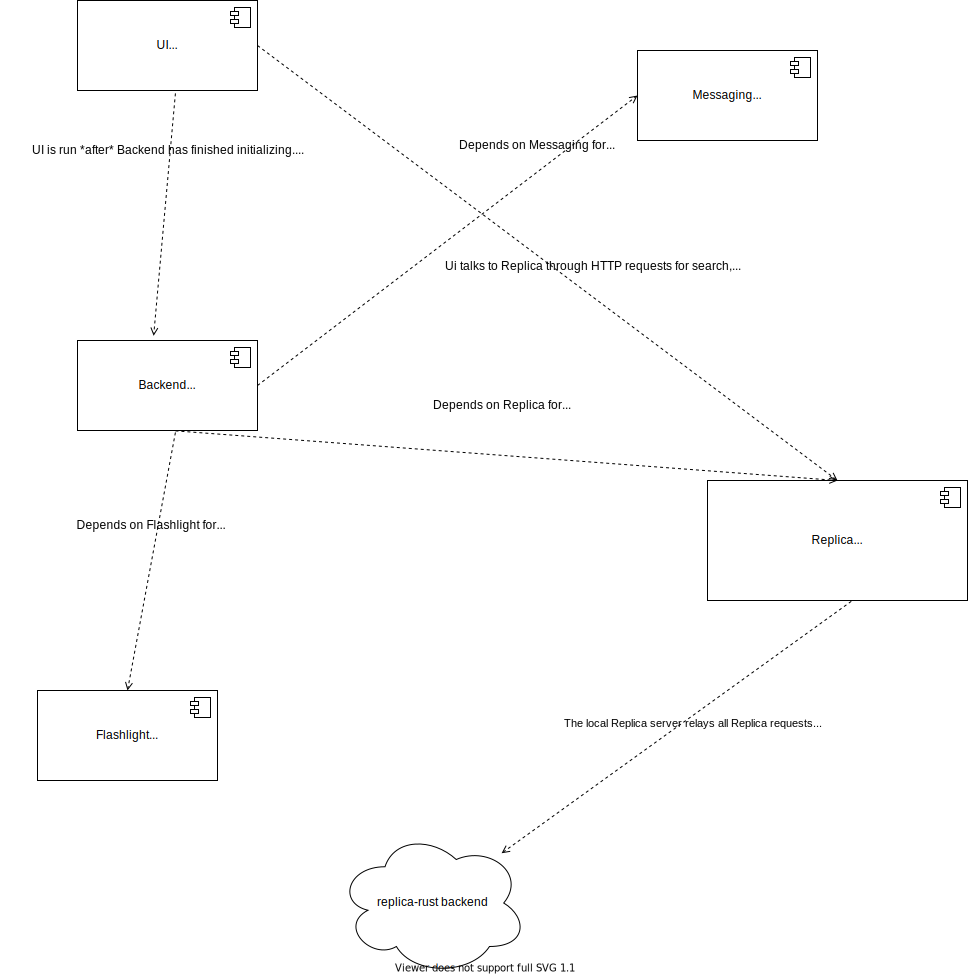
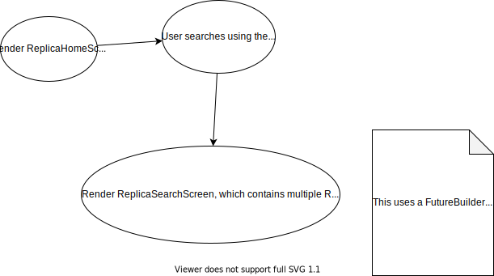
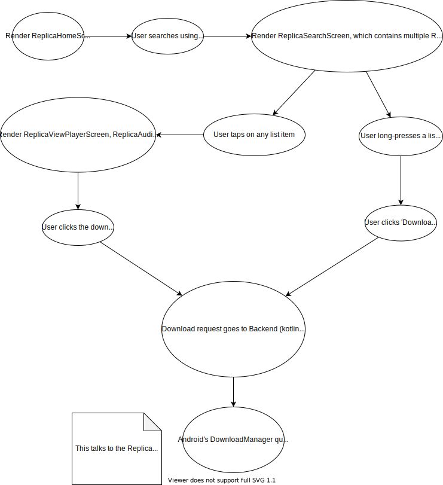
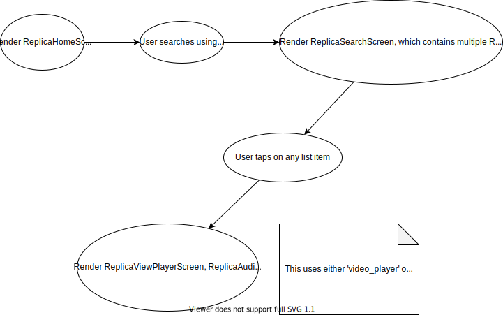
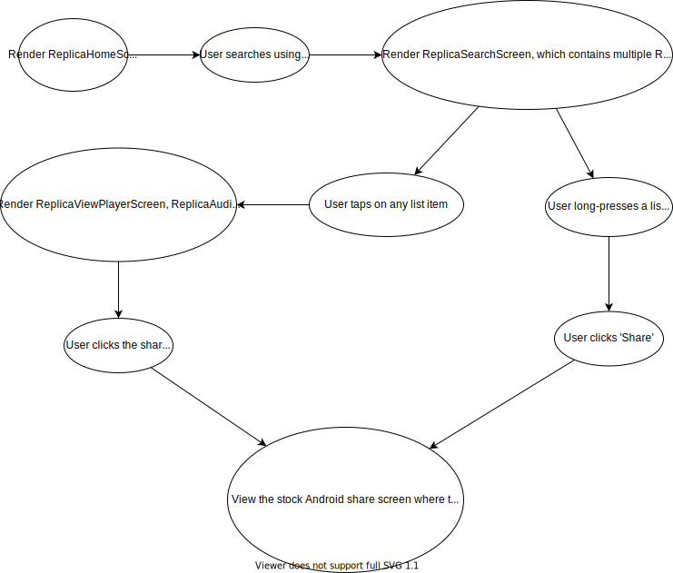
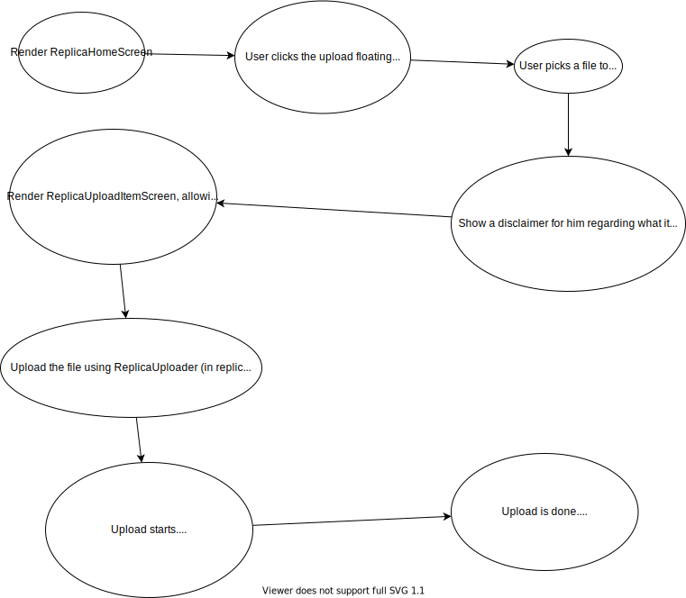
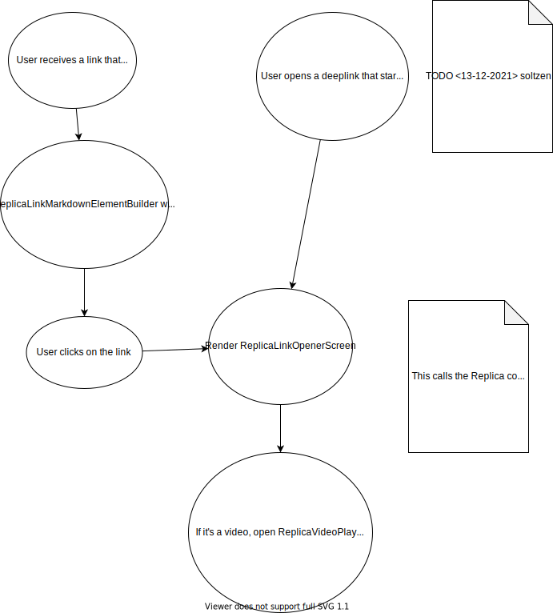

# Feature - Replica Mobile

- This feature aims to integrate the Replica File Sharing project in Android
- It is forked from the Messaging feature located in [ox/messaging](https://github.com/getlantern/android-lantern/tree/ox/messaging)
- Maintainers: @soltzen
- Story ticket: https://github.com/getlantern/lantern-internal/issues/5080
- Task Board:
  - https://github.com/orgs/getlantern/projects/9#column-16581691
  - and sporadic tasks in https://github.com/orgs/getlantern/projects/5
  - All tickets should have the [replica-mobile](https://github.com/getlantern/lantern-internal/labels/replica-mobile) label

## Overview

**Note** Preview the images below in two ways:
- Install VSCode and [this extension](https://github.com/hediet/vscode-drawio)
  - Open this README
  - Run 'Markdown: Open preview to the side' command
- Open draw.io in a browser
  - Copy-paste the `.drawio.svg` files there

### Replica Flows

#### Searching

#### Downloading

#### Viewing Audio/Video/Images

#### Sharing

#### Uploading

#### Opening a Replica Link

